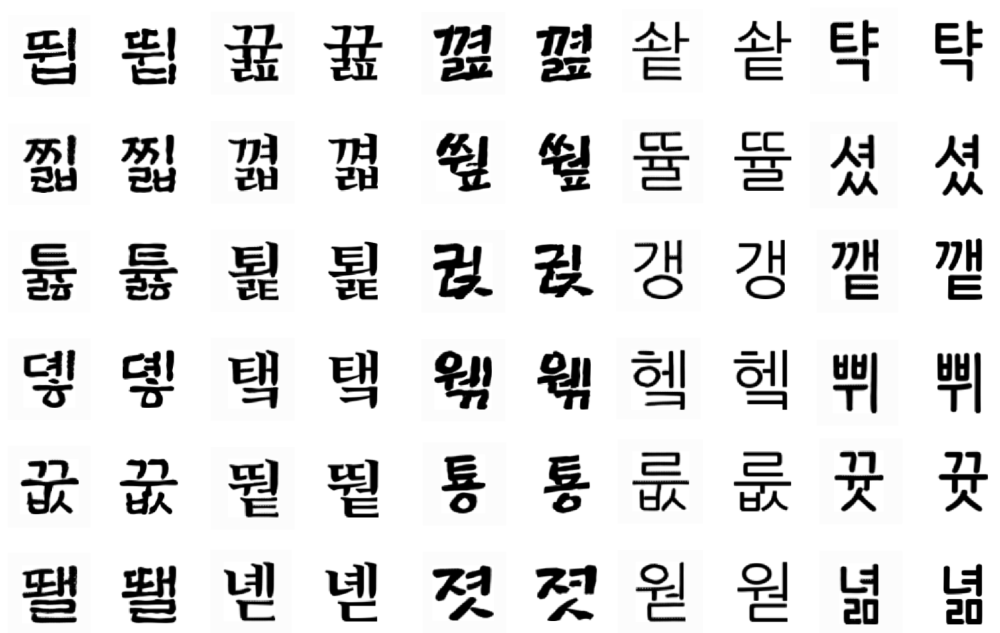
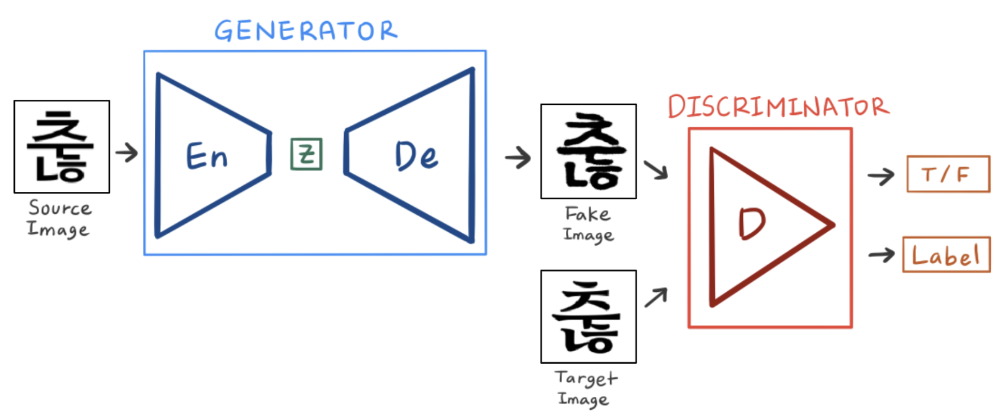
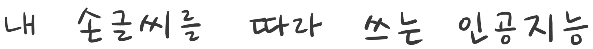
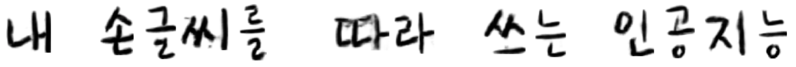

# My Handwriting Font, 내 손글씨를 따라쓰는 인공지능


　    


<p align="center"></p>
<p align="center">왼쪽 : 모델이 생성한 가짜 이미지 / 오른쪽 : 실제 폰트 이미지</p>


　    


## \# 프로젝트 소개
이 프로젝트는 GAN 기반 모델을 활용해 사람의 손글씨를 학습하고, 그 글씨체를 반영한 글자 이미지를 생성하는 것입니다. 사람의 손글씨를 학습하기 전에, 먼저 약 75,000장 정도의 대량의 컴퓨터 폰트 글자 이미지로 사전 학습을 진행하고, 그 후 약 200장의 적은 양의 사람 손글씨 데이터로 전이 학습(Transfer Learning)을 진행합니다.


　     


## \# 모델의 구조
<p align="center"></p>

모델의 기본 구조는 GAN으로, Generator와 Discriminator로 구성됩니다.
- **Generator** 는 고딕체 이미지를 입력받아 스타일이 변환된 이미지를 출력하는 역할을 하기 때문에 Encoder와 Decoder로 이루어진다는 점이 Vanilla GAN과 다릅니다. 이미지를 생성한 후 생성된 Fake Image와 Real Image와 비교해 손실함수를 계산하며 학습합니다.  
- **Discriminator** 는 이미지를 입력받아 Real Image인지 Fake Image인지에 대한 확률값을 출력하는 동시에, 글자의 폰트 카테고리를 분류합니다. 이 두가지 모두에 대해 손실함수를 계산해 학습합니다.


　    


## \# Pre-Training
> 사전학습의 과정은 [kaonashi-tyc](https://github.com/kaonashi-tyc)가 중국어로 진행한  [zi2zi](https://github.com/kaonashi-tyc/zi2zi) 프로젝트의 도움을 받았습니다.  


　    


<p align="center"></p>
<p align="center">[Pre-Training 과정] 데이터 : 75,000장 / 150 epoch</p>


　     


모델은 먼저 약 150epoch를 밑바닥부터 학습합니다.   

- 1~30epoch : `L1_penalty=100`, `Lconst_penalty=15`
- 31~150epochh : `L1_penalty=500`, `Lconst_penalty=1000`


학습 초기단계인 30epoch까지는 모델이 전체적인 글자의 형상을 빠르게 잡을 수 있도록 L1 loss에 대해 더 큰 가중치를 두고 학습합니다. 그 후 150epoch까지 학습할 때는 constant loss에 더 큰 가중치를 둡니다.


　    


## \# Transfer Learning: 손글씨 학습
<p align="center"></p>
<p align="center">[Transfer Learning 과정] 데이터 : 210장 / 550 epoch</p>


　     


150epoch의 사전학습이 끝난 모델로 사람의 손글씨를 학습합니다. 위 이미지는 151~550epoch 까지 학습하는 과정입니다. epoch 수가 많지만, 데이터가 210장으로 적어서 학습시간이 훨씬 짧습니다.


　    


<p align="center"></p>


　     


<p align="center"></p>


　     


위의 두 이미지 중, 위쪽 이미지는 진짜 사람이 직접 쓴 글씨이고, 아래 이미지는 손글시를 모두 학습한 모델이 생성한 이미지입니다.   
위에 쓰여있는 '내 손글씨를 따라 쓰는 인공지능' 13자는 모두 모델이 학습한 210자에 포함되지 않은 글자입니다. 즉, 모델은 모든 한글을 학습하지 않고 사람이 직접 쓴 일부만 학습했지만, 나머지 글자들을 비슷한 스타일로 생성할 수 있습니다.


　    


## \# Codes
```
common
├── dataset.py              # load dataset, data pre-processing
├── function.py             # deep learning functions : conv2d, relu etc.
├── models.py               # Generator(Encoder, Decoder), Discriminator
├── train.py                # model Trainer
└── utils.py                # data pre-processing etc.

get_data
├── font2img.py             # font.ttf -> image
└── package.py              # .png -> .pkl

main
├── making_datasets.py      # datasets for pretraining
└── making_model.py         # (Unfinished) make pretrained-model
└── making_pickle.py        # .png -> .pkl

[.pkl and .obj files](http://naver.me/G1wgSrh4)    # val.pkl, train.pkl, val.obj, train.obj
```


　    


## \# Acknowledgements
```
Code derived and rehashed from:

- [zi2zi](https://github.com/kaonashi-tyc/zi2zi) by [kaonashi-tyc](https://github.com/kaonashi-tyc)
  -> 생성적 적대 신경망(Generative Adversarial Network, GAN)의 주요 구성 요소를 차용

- [neural-fonts](https://github.com/periannath/neural-fonts) by[periannath](https://github.com/periannath)
  -> 손글씨 템플릿 이용.

- [GAN-handwriting-styler](https://github.com/jeina7/GAN-handwriting-style) by [jeina7](https://github.com/jeina7)
  -> GAN의 손실 함수 차용
```
```
code created using concepts from:
- [blog](https://jeinalog.tistory.com/15)
  -> 데이터셋 생성 과정
  -> pre-trained 모델의 학습절차
  
```


　    


## \# Lisence
MIT Lisence
